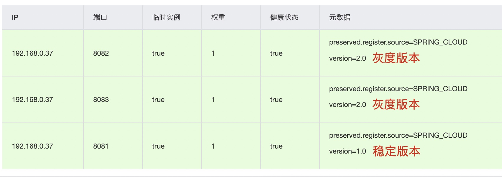

## 灰度发布

灰度发布，gateway 结合 nacos 实现灰度发布功能

### 模块介绍

1. colin-demo：接口模块

    - 稳定版本输出内容：hello controller，并显式端口号，可以启动多个实例，以实现负载均衡效果

    - 灰度版本输出内容：hello gray controller，并显式端口号，可以启动多个实例，以实现负载均衡效果

    - 启动时需在 nacos 元数据中配置对应的 version 版本号，例如，稳定版本 version = 1.0；灰度版本 version = 2.0

        

2. colin-gatew：网关模块

    - 网关模块中重写了负载均衡算法
    - 网关模块中添加了拦截器，根据请求 header 中的参数来筛选稳定实例和灰度实例，并交由负载均衡算法处理
    - 网关中配置灰度名单，即灰度名单中配置的用户访问灰度实例，灰度名单中未配置的用户则访问稳定实例

### 测试

1. 请求头中参数为灰度名单用户

    

2. 请求头中参数为非灰度名单用户

    